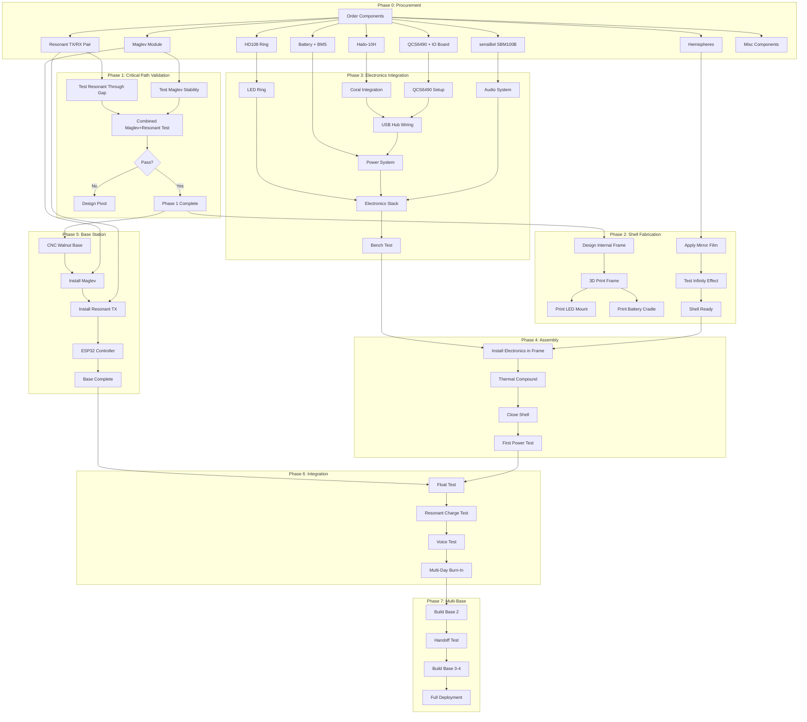

# Kagami Orb — Dependency Graph

## Build Order

This document defines the critical path and dependencies for building the Kagami Orb.

---

## Phase Diagram



---

## Critical Path

The longest path through the dependency graph:

```
Order Components (Day 0)
        │
        ▼ 14 days (shipping)
Receive Maglev + Resonant (Day 14)
        │
        ▼ 2 days
Critical Path Validation (Day 16)
        │
        ▼ 3 days
Shell Fabrication Start (Day 19)
        │
        ▼ 7 days (parallel with electronics)
Electronics Stack Complete (Day 26)
        │
        ▼ 3 days
Shell Assembly (Day 29)
        │
        ▼ 5 days
Base Station Complete (Day 34)
        │
        ▼ 3 days
Float + Integration Test (Day 37)
        │
        ▼ 7 days
Burn-In + Polish (Day 44)
        │
        ▼ 7 days
Multi-Base Deployment (Day 51)

═══════════════════════════════════════════════════
TOTAL CRITICAL PATH: ~7-8 weeks
═══════════════════════════════════════════════════
```

---

## Dependency Matrix

| Task | Depends On | Duration | Can Parallelize |
|------|------------|----------|-----------------|
| **Phase 0: Procurement** ||||
| Order all components | - | 1 day | - |
| Receive maglev/Resonant | Order | 14 days | - |
| Receive QCS6490/Coral | Order | 5 days | Yes |
| Receive sensiBel SBM100B | Order | 7 days | Yes |
| Receive hemispheres | Order | 7 days | Yes |
| **Phase 1: Validation** ||||
| Test maglev stability | Receive maglev | 2 hours | - |
| Test Resonant through gap | Receive Resonant | 3 hours | Yes (with maglev) |
| Combined test | Both tests pass | 4 hours | - |
| **Phase 2: Shell** ||||
| Apply mirror film | Receive hemispheres | 3 hours | Yes |
| Design internal frame | Validation complete | 4 hours | - |
| 3D print frame | Design complete | 8 hours | - |
| Print LED mount | Frame design | 3 hours | Yes (after frame) |
| Print battery cradle | Frame design | 4 hours | Yes |
| **Phase 3: Electronics** ||||
| QCS6490 setup | Receive QCS6490 | 2 hours | Yes |
| Coral integration | QCS6490 setup | 2 hours | - |
| USB hub wiring | Coral done | 3 hours | - |
| Audio system | Receive sensiBel SBM100B | 3 hours | Yes |
| Power system | Receive battery | 4 hours | Yes |
| LED ring setup | Receive LEDs | 2 hours | Yes |
| Electronics bench test | All electronics | 4 hours | - |
| **Phase 4: Assembly** ||||
| Install in frame | Frame + electronics | 4 hours | - |
| Thermal compound | Install done | 1 hour | - |
| Close shell | Thermal done | 2 hours | - |
| First power test | Shell closed | 1 hour | - |
| **Phase 5: Base Station** ||||
| CNC walnut base | Validation complete | 4 hours | Yes |
| Install maglev | Base + maglev | 2 hours | - |
| Install Resonant TX | Maglev installed | 2 hours | - |
| ESP32 controller | Resonant TX installed | 3 hours | - |
| **Phase 6: Integration** ||||
| Float test | Orb + Base complete | 2 hours | - |
| Resonant charge test | Float successful | 2 hours | - |
| Voice test | Charge working | 4 hours | - |
| Burn-in | All tests pass | 7 days | - |
| **Phase 7: Multi-Base** ||||
| Build base 2 | Burn-in complete | 1 day | - |
| Handoff test | Base 2 complete | 4 hours | - |
| Build bases 3-4 | Handoff works | 2 days | - |
| Full deployment | All bases | 1 day | - |

---

## Parallel Work Streams

These tasks can be done simultaneously:

```
WEEK 1-2 (While waiting for components)
────────────────────────────────────────

Stream A: Firmware Development
  • Set up Rust/Embassy environment
  • Implement state machine
  • Implement LED patterns
  • Mock API integration

Stream B: CAD Design
  • Design internal frame (OnShape)
  • Design LED mount
  • Design battery cradle
  • Generate STL files

Stream C: API Development
  • Implement orb WebSocket endpoint
  • Implement orb REST endpoints
  • Test with mock client


WEEK 3 (Components arriving)
────────────────────────────────────────

Stream A: Critical Path Testing
  • Maglev stability tests
  • Resonant efficiency tests
  • Combined testing

Stream B: Shell Preparation
  • Apply mirror films
  • Test infinity effect
  • 3D print structural parts

Stream C: Electronics Setup
  • QCS6490 + Coral on bench
  • sensiBel SBM100B testing
  • LED ring testing


WEEK 4 (Integration)
────────────────────────────────────────

Stream A: Orb Assembly
  • Mount electronics in frame
  • Wire power system
  • Close shell

Stream B: Base Station
  • CNC walnut enclosure
  • Install maglev + Resonant TX
  • ESP32 firmware
```

---

## Risk Checkpoints

| Checkpoint | Day | Pass Criteria | Pivot If Fail |
|------------|-----|---------------|---------------|
| **CP1: Resonant Validation** | 16 | ≥10W at 15mm gap | Reduce gap or wired power |
| **CP2: Maglev Stability** | 16 | Stable at 400g | Reduce weight target |
| **CP3: Combined Test** | 17 | No EMI, stable | Shield or frequency change |
| **CP4: Thermal Test** | 26 | <70°C internal | Add vents |
| **CP5: Voice Test** | 38 | 95% wake at 2m | Tune beamforming |
| **CP6: Float Duration** | 44 | 8 hours stable | Debug stability |

---

## Resource Requirements

### Tools Required

| Tool | Phase | Notes |
|------|-------|-------|
| Soldering station | 3, 5 | Fine pitch work |
| Multimeter | All | Diagnostics |
| Oscilloscope | 3, 5 | Signal debugging |
| Power supply (bench) | 1, 3 | Testing |
| Form 4 (3D printer) | 2 | Internal structure |
| Glowforge (laser) | 5 | Base decorations |
| CNC router | 5 | Walnut base (or commission) |

### Skills Required

| Skill | Phase | Can Outsource? |
|-------|-------|----------------|
| Embedded Rust | 3, 4 | Difficult |
| PCB assembly | 3 | Yes (PCBA service) |
| 3D printing | 2 | Yes |
| Woodworking/CNC | 5 | Yes |
| Wireless power | 1, 3 | Difficult |
| Audio DSP | 3 | Yes (use sensiBel SBM100B defaults) |

---

## Go/No-Go Decision Points

### After Phase 1 (Day 17)

**Go Criteria:**
- [ ] Resonant delivers ≥10W at 15mm
- [ ] Maglev stable at 380g
- [ ] No significant EMI
- [ ] Components within budget

**No-Go Actions:**
- Document findings
- Identify pivot options
- Reassess timeline/budget

### After Phase 4 (Day 30)

**Go Criteria:**
- [ ] Orb powers on
- [ ] WiFi connects
- [ ] LEDs animate correctly
- [ ] Wake word detects

**No-Go Actions:**
- Debug specific failure
- Consider modular rebuild

### After Phase 6 (Day 44)

**Go Criteria:**
- [ ] 8-hour float test passes
- [ ] Voice works at 3m
- [ ] No thermal issues
- [ ] Battery life ≥4 hours

**No-Go Actions:**
- Identify root cause
- Design revision
- Extended testing

---

```
h(x) ≥ 0. Always.

The graph shows the path.
Dependencies are constraints.
The critical path is the prize.

鏡
```
